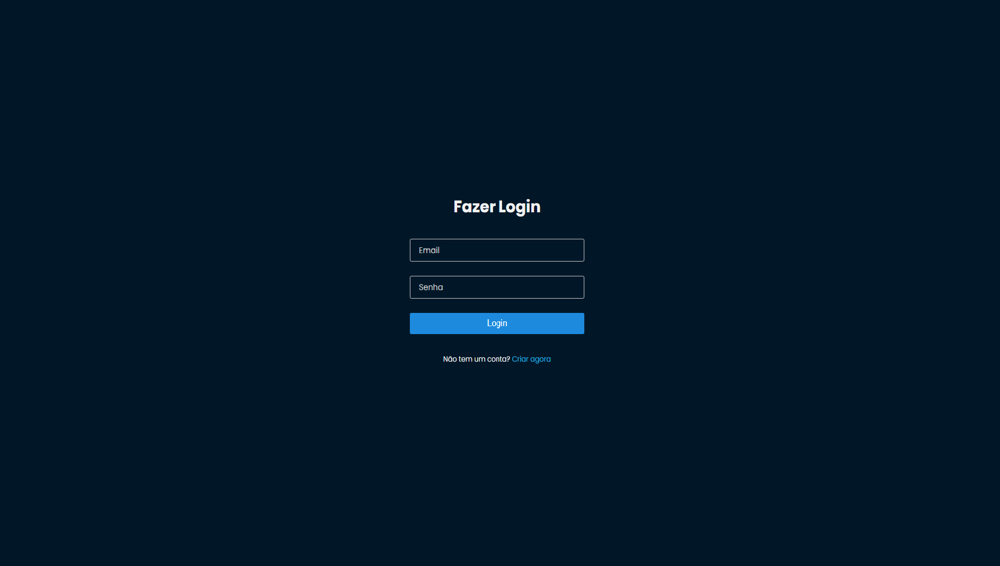
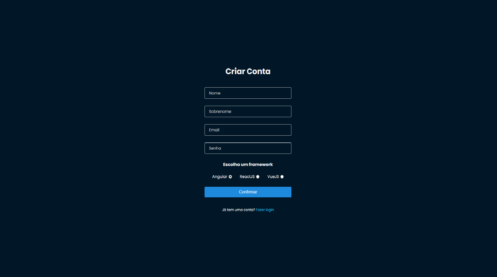

<h1>SignIn/SignUp</h1>

Formulários são features que faz parte do cotidiano de um Desenvolvedor, são muito importantes para a conexão do usuário com a aplicação seja
com Login, envio de e-mails, pagamentos etc..
Sabendo disso decidi criar esse projeto para praticar e ver seu funcionamento de perto.

<h2>Objetivo:</h2>

Praticar e aprender novas tecnologias. Gostei de usar o Styled-Components para criação de estilos e
aprendi a criar formulários com validações usando Hooks do ReactJS.


<h2>Bibliotecas/Tecnologias utilizadas: </h2>

- [Vite](https://vitejs.dev)
- [ReactJS](https://pt-br.reactjs.org)
- [React-Router-Dom](https://v5.reactrouter.com/web/guides/quick-start)
- [Styled-Components](https://styled-components.com)


<h2>Imagens:</h2>




<h2>Funcionalidades</h2>

- Rotas para logar ou criar conta.
- Campos validados.
- Mensagem de erro ou sucesso.

<h2>Rodando o projeto:</h2>

OBS: É necessário que tenha o [NodeJS](https://nodejs.org/en/) e o [Git](https://git-scm.com) instalados em sua máquina!

<h2></h2>

```bash 
1. Clone o repositório:
$ git clone https://github.com/gabriellima2/form-reactjs.git

2. Acesse a pasta e instale as dependências via terminal:
$ npm install

3. Inicie a aplicação em modo de desenvolvimento:
$ npm run dev

4. O servidor será aberto em http://localhost:3000
```

<p align="center">Projeto feito com 💙 por <a href="https://www.linkedin.com/in/gabriel-lima-860612236">Gabriel Lima</a></p>

